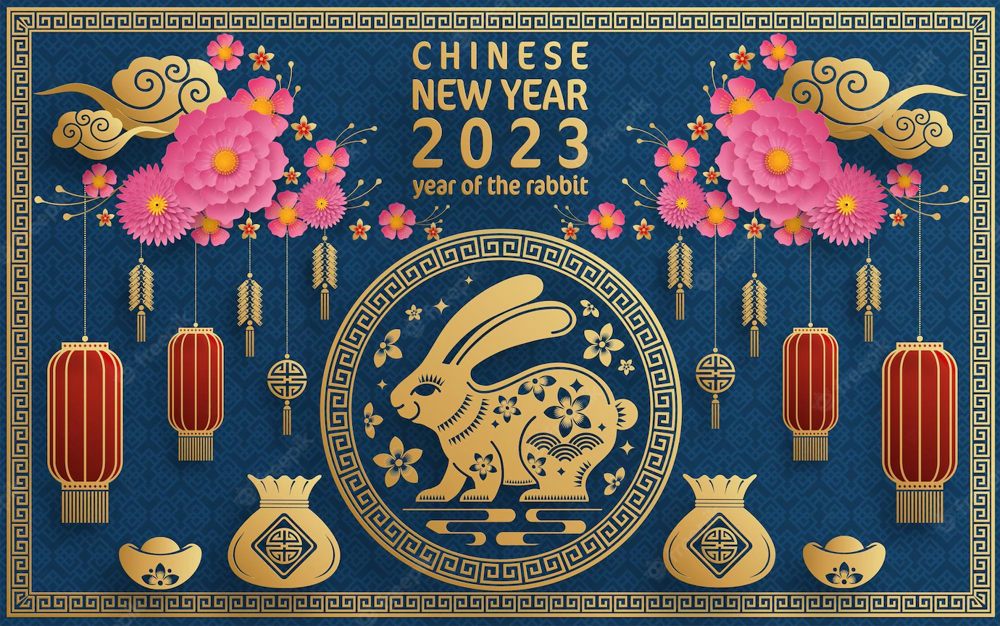

## Chinese New Year Greetings to Wish Wealth & Prosperity
Money and wealth are highly valued in Chinese culture. They are even more so when they are regarded as being intertwined with having good luck. It is considered polite and appropriate to offer money-related greetings in the New Year. Especially towards our colleagues and bosses, these Chinese New Year greetings are extremely well-received. Here are a list of wealth and prosperity phrases that you can use right away:

* 恭喜发财 (gōng xǐ fā cái) – May you be happy and prosperous
* 财源广进 (cái yuán guǎng jìn) – May your money and treasures be plentiful
* 招财进宝 (zhāo cái jìn bǎo) – May wealth and treasures fill your home
* 一本萬利 (yī běn wàn lì) –  Wishing that you reap a huge profit from a small investment
* 财源滾滾 (cái yuán gǔn gǔn) –  May wealth come pouring in
* 吉星高照 (jí xīng gāo zhào) – May good fortune fall upon 
* 大吉大利 (dà jí dà lì) –  May you have great luck and great profit
* 年年有馀 (nián nián yǒu yú) – Wishing you abundance and prosperity every year
* 新年大吉 (xīn nián dà jí) – Wishing you luck for the new year

## Chinese New Year Greetings for Happiness, Health & Peace
Of course, there are other important things apart from just good fortune and good luck. You can also wish them peace, good health and immense happiness. Whether towards your elders, friends, family or colleagues, these greetings are generally good for anyone you love and care about:

* 恭贺新禧 (gōng hè xīn xǐ) – Good luck in the year ahead
* 心想事成 (xīn xiǎng shì chéng) – May all your wishes come true
* 万事如意 (wàn shì rú yì) – May everything go well for you
* 笑口常开 (xiào kǒu cháng kāi) – May your year be filled with abundance of smiles and laughter
* 五福临门 (wǔ fú lín mén) – May the five blessings (longevity, wealth, health, virtue, and a natural death) come to you
* 身体健康 (shēn tǐ jiàn kāng) – Wishing you good health
* 龙马精神 (lóng mǎ jīng shén) – Wishing you lots of energy and good spirit
* 出入平安 (chū rù píng ān) – Wishing you safety and peace where ever you go
* 福寿双全 (fú shòu shuāng quán) – May you enjoy both longevity and blessing
* 一帆风顺 (yī fān fēng shùn) – May all that you do go smoothly
* 阖家幸福 (hé jiā xìng fú) – May your whole family be filled with happiness
* 四季平安过旺年 (sì jì píng ān guò wàng nián) – Wishing you four seasons of peace and a flourishing year

### text [from](https://justlogin.com/blog/chinese-new-year-greetings/) 